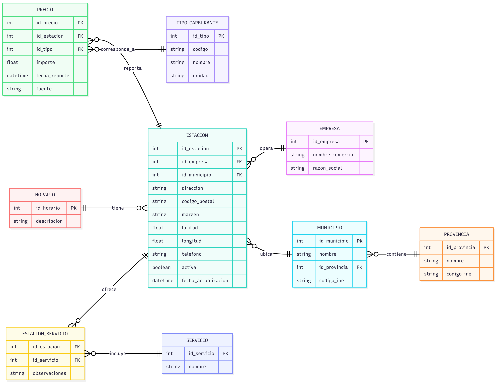

# Solución del laboratorio. Diseño de una base de datos relacional

## Descripción

Esta solución constituye una propuesta de solución al ejercicio propuesto en el laboratorio. Si así se desea, puede emplearse como esquema base para otras actividades.

## Diagrama entidad-relación

### Notas sobre el modelo

* `EMPRESA`: Tabla que representa el rótulo o empresa operadora de la estación.
* `PROVINCIA` / `MUNICIPIO`: Estructura jerárquica basada en codificación INE.
* `ESTACIÓN`: Entidad principal basada en identificadores (IDs), incluye ubicación, margen, datos técnicos y geolocalización.
* `TIPO_CARBURANTE`: Catálogo de carburantes estandarizado.
* `PRECIO`: Modelo orientado a históricos donde cada fila representa un precio de un tipo de carburante en una estación determinada en una fecha concreta.
* `HORARIO`: Texto libre, se enlaza 1 a 1 con la estación (aunque podría ser 1 a N si se desea granularidad por día).
* `SERVICIO` / `ESTACION_SERVICIO`: Permite representar características opcionales de cada estación.

## Código SQL para implementar el esquema

El código para implementar este esquema de base de datos en Postgres puede encontrarse en [este enlace](code/esquema-db.sql).
