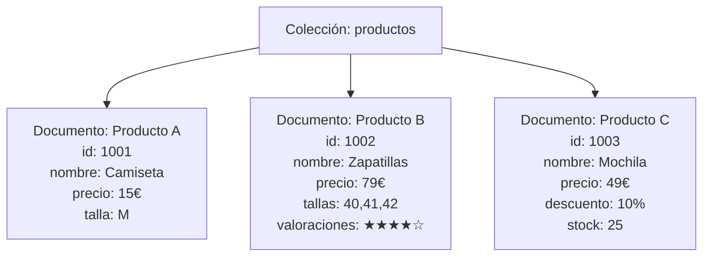
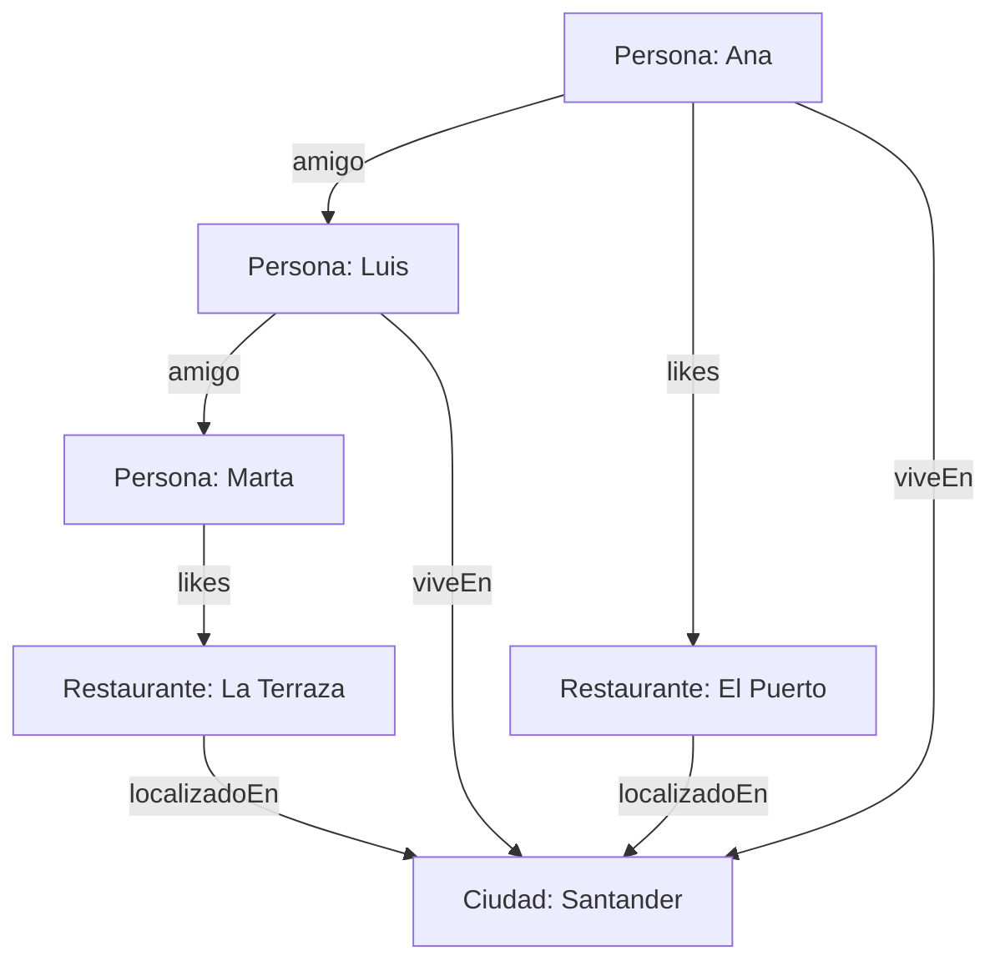
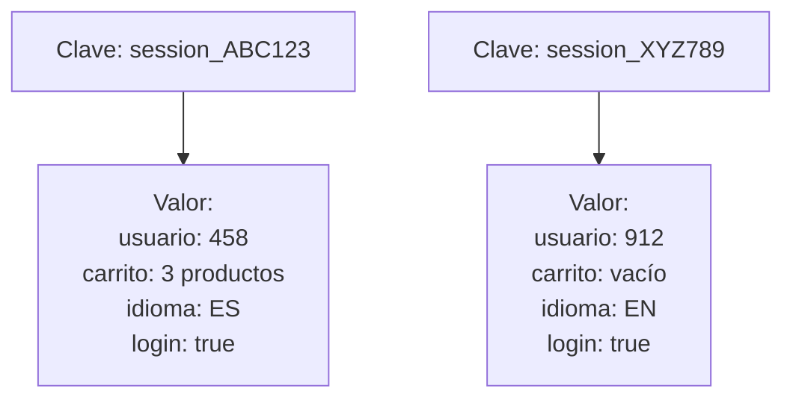

# Tema 10 – Resumen: Bases de datos NoSQL con ejemplos del mundo real

## 1. ¿Qué son las bases de datos NoSQL?

Las **bases de datos NoSQL** (Not Only SQL) surgen como respuesta a las limitaciones de las bases de datos relacionales tradicionales cuando se trabaja con:

* Grandes volúmenes de datos (Big Data)
* Alta concurrencia de usuarios
* Baja latencia
* Modelos de datos cambiantes o poco estructurados

A diferencia de las bases de datos relacionales, **no utilizan tablas con filas y columnas**, sino modelos de almacenamiento más flexibles y optimizados para distintos tipos de datos.

**Características clave:**

* Esquema flexible o inexistente
* Escalabilidad horizontal (clústeres distribuidos)
* Alto rendimiento
* APIs especializadas según el tipo de base de datos

## 2. Bases de datos orientadas a documentos

### Concepto

El elemento central es el **documento**, normalmente representado en formatos como **JSON o BSON**. Cada documento es equivalente a un registro, pero **no todos los documentos tienen por qué compartir la misma estructura**.

Esto permite que el modelo de datos evolucione con el tiempo sin migraciones complejas.

#### Ejemplo del mundo real

**Catálogo de productos de un e-commerce**

* Un producto puede tener solo nombre y precio.
* Otro puede incluir variantes, valoraciones, imágenes, descuentos o datos logísticos.
* Cada producto se almacena como un documento independiente.

Esto encaja muy bien en sistemas donde la información es heterogénea y cambia con frecuencia.

**Diagrama conceptual**

#### Casos de uso típicos

* Catálogos de productos
* Perfiles de usuario
* Sistemas de gestión de contenidos (CMS)
* Aplicaciones web modernas

#### Tecnologías representativas

* MongoDB
* Couchbase

## 3. Bases de datos orientadas a grafos

### Concepto

En este modelo los datos se representan como:

* **Nodos:** entidades (personas, productos, ciudades…)
* **Aristas:** relaciones entre entidades (amistad, compra, vive en…)

Las relaciones se almacenan explícitamente, lo que hace que las consultas sobre conexiones sean extremadamente eficientes.

#### Ejemplo del mundo real

**Red social**

* Nodos: usuarios, restaurantes, ciudades
* Relaciones: “es amigo de”, “le gusta”, “vive en”, “está ubicado en”

Consultas como:

* “¿Qué restaurantes gustan a mis amigos?”
* “¿Qué ciudad concentra más usuarios activos?”

Son mucho más eficientes en un modelo de grafo que en uno relacional.

**Diagrama conceptual**

#### Casos de uso típicos

* Redes sociales
* Sistemas de recomendación
* Detección de fraude
* Análisis de dependencias y relaciones complejas

#### Tecnologías representativas

* Neo4j
* OrientDB
* AllegroGraph

## 4. Bases de datos clave-valor

### Concepto

Funcionan como una **gran tabla hash**, donde cada valor se accede mediante una clave única. Son extremadamente rápidas, pero **no están pensadas para consultas complejas ni relaciones entre datos**.

#### Ejemplo del mundo real

**Gestión de sesiones en una aplicación web**

* Clave: `session_id`
* Valor: datos de sesión del usuario (usuario autenticado, carrito, preferencias)

Cada vez que el usuario realiza una acción, la aplicación recupera la sesión usando la clave.

**Diagrama conceptual**

#### Casos de uso típicos

* Gestión de sesiones
* Carritos de compra
* Caché de datos
* Contadores, rankings, estados temporales

#### Tecnologías representativas

* Redis
* Amazon DynamoDB
* Apache Cassandra
* Riak

## 5. ¿Cuándo usar NoSQL y cuándo no?

**Escenarios adecuados para NoSQL:**

* Grandes volúmenes de datos distribuidos
* Necesidad de alta disponibilidad
* Modelos de datos flexibles
* Aplicaciones con alta carga de lectura/escritura

**Escenarios menos adecuados:**

* Sistemas que requieren fuertes garantías de integridad referencial
* Transacciones complejas con múltiples JOIN
* Modelos de datos muy estructurados y estables

En la práctica, muchas arquitecturas modernas combinan **bases de datos relacionales y NoSQL**, usando cada una donde mejor encaja.

## 6. Reflexión final

NoSQL no sustituye a SQL, sino que **amplía el conjunto de herramientas** disponibles para diseñar sistemas escalables, flexibles y de alto rendimiento.

Elegir el tipo de base de datos correcto es una **decisión de arquitectura**, no de moda tecnológica.
