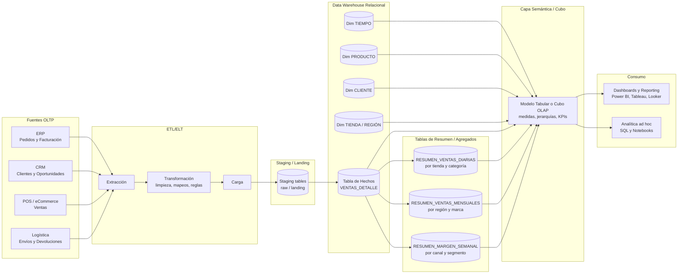
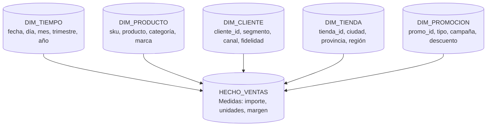
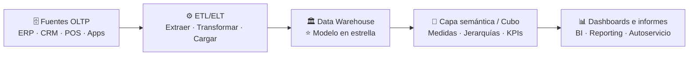

# Tema 11 - Data Warehouse y OLAP

## Origen de los Data Warehouse

Las organizaciones necesitan **conservar y explotar datos históricos** para apoyar la **toma de decisiones**. Mezclar ese análisis histórico con los sistemas transaccionales del día a día suele degradar el rendimiento, por lo que se separan ambos mundos mediante un **almacén de datos (Data Warehouse, también conocido como DW)**.

### OLTP vs OLAP (idea central)

* **OLTP (On-Line Transaction Processing):** orientado a **transacciones** (operación diaria). 
* **OLAP (On-Line Analytical Processing):** orientado al **análisis**, tendencias y reporting para decisiones. 

### Propiedades del Data Warehouse

* Organizado por **áreas del negocio**.
* Integra datos desde **múltiples fuentes OLTP**.
* No se actualiza necesariamente en tiempo real (cargas periódicas). 

**Beneficios esperables:** competitividad, productividad y potencial de mayores ganancias. 

## Componentes y retos típicos en un almacén de datos

En un DW aparecen retos operativos y de diseño, por ejemplo: **cuándo recoger datos**, **qué arquitectura elegir**, **cómo integrar fuentes heterogéneas**, y la **transformación/limpieza** antes de cargar. 

### Flujo ETL clásico

1. **Extracción:** recuperar datos desde orígenes.
2. **Transformación:** adaptar/limpiar/convertir (p. ej., unidades de medida).
3. **Carga:** introducir en el DW. 

También es habitual:

* **Propagar actualizaciones** desde orígenes al DW.
* Usar **resúmenes** para acelerar consultas sobre volúmenes grandes. 

## Arquitecturas de Data Warehouse que debes conocer

En este tema se distinguen dos enfoques principales: 

### A) Arquitectura con tablas de resumen

Se guardan datos detallados y, además, **tablas de resumen** para evitar recalcular agregados frecuentes (mejoran el rendimiento analítico). La siguiente figura, ilustra un ejemplo de esta arquitectura.

### B) Esquema en estrella (Star Schema)

* **Tabla de hechos:** medidas del negocio (p. ej., importe, unidades, margen).
* **Tablas de dimensiones:** ejes de análisis (p. ej., producto, cliente, región, tiempo).

La siguiente figura, ilustra un ejemplo de esta arquitectura.

Variantes:

* **Copo de nieve (Snowflake):** dimensiones más normalizadas.
* **Copo de estrella:** combinación de dimensiones normalizadas y no normalizadas. 

Además, se introduce la idea de **MOLAP** (bases multidimensionales) que suelen visualizarse como “cubos”: cada dimensión es un eje; añadir una dimensión implica pasar a un “hipercubo”. 

## OLAP: qué es y para qué se usa en negocio

OLAP forma parte de **Business Intelligence**, y busca **consultar grandes volúmenes con rapidez** usando estructuras multidimensionales (cubos) que contienen **resúmenes** de datos provenientes de sistemas transaccionales. 

### Ejemplos típicos de uso (negocio)

* **Retail/eCommerce:** ventas por producto–región–mes, márgenes por categoría, comparativas año contra año.
* **Marketing:** rendimiento de campañas por canal–segmento–periodo, atribución básica y seguimiento de conversiones.
* **Dirección/finanzas:** P&L por unidad de negocio, desviaciones vs presupuesto por trimestre, KPIs ejecutivos.
* **Operaciones:** tiempos de entrega por almacén–transportista–semana, incidencias por zona.
* **RR. HH.:** rotación por departamento–antigüedad–mes, absentismo por centro–turno.
  (Estos ejemplos encajan con la finalidad descrita en el tema: informes de ventas, marketing, dirección y minería de datos). 

### Concepto clave: el cubo OLAP

Un **cubo OLAP** es un “array multidimensional” que permite **agrupar, segmentar y reorganizar** grandes cantidades de datos según las necesidades del usuario. 

## Tipos de implementación OLAP

Los tres enfoques más comunes son los siguientes: 

1. **MOLAP:** datos en una **base de datos multidimensional**.
2. **ROLAP:** datos en una **BD relacional**, normalmente **desnormalizada**, con detalle (agregaciones bajo demanda o preagregadas según diseño).
3. **HOLAP:** híbrido; algunos resúmenes (a menudo en memoria o estructuras optimizadas) y el detalle en relacional. 

## Herramientas para implementar OLAP (ecosistema real)

### a) Motores / plataformas OLAP (cubo o semántica)

* **Microsoft SQL Server Analysis Services (SSAS)**: cubos/tabular.
* **Azure Analysis Services** (según entorno) y **Power BI semantic model** (modelo tabular en el servicio).
* **Apache Kylin** (OLAP sobre big data, cubos/preagregaciones).
* **Mondrian (Pentaho)** (ROLAP clásico, más legado pero didáctico).

### b) Data Warehouse en la nube (comúnmente usado para ROLAP/HOLAP)

* **Snowflake**
* **Google BigQuery**
* **Amazon Redshift**
* **Azure Synapse Analytics**

### c) BI / visualización (consumen el DW/OLAP)

* **Power BI**
* **Tableau**
* **Looker / Looker Studio**
* **Qlik Sense**

### d) ETL/ELT (para construir el DW)

* **dbt** (transformación ELT)
* **Informatica / Talend**
* **Microsoft SSIS**
* **Azure Data Factory**
* **AWS Glue**
* **Airflow** (orquestación)

La siguiente figura, muestra una visión práctica de como se pueden conectar todas las piezas para crear una solución de gestión de datos empleando un DW y OLAP como elementos clave.

